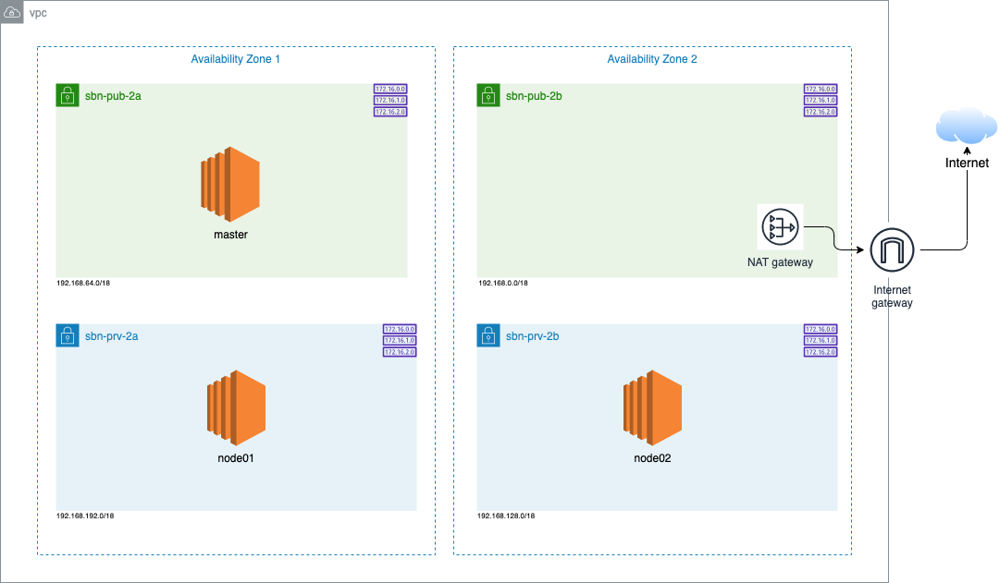
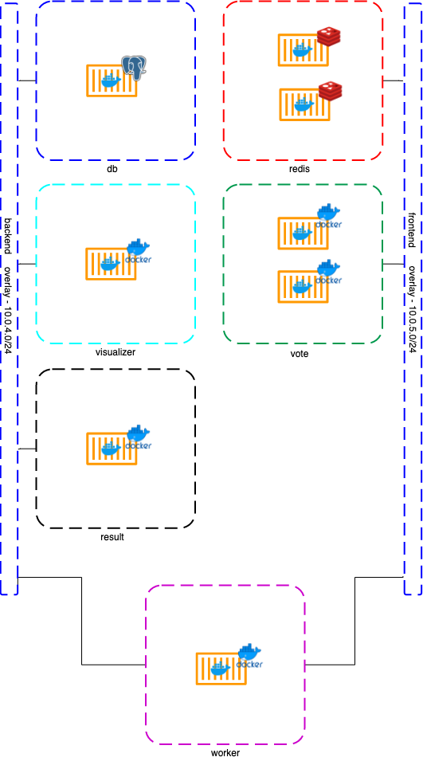
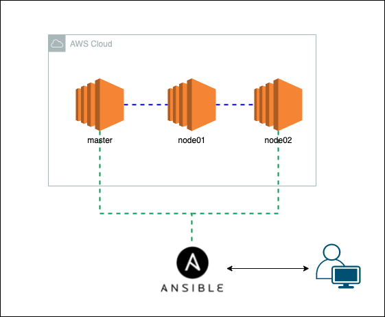
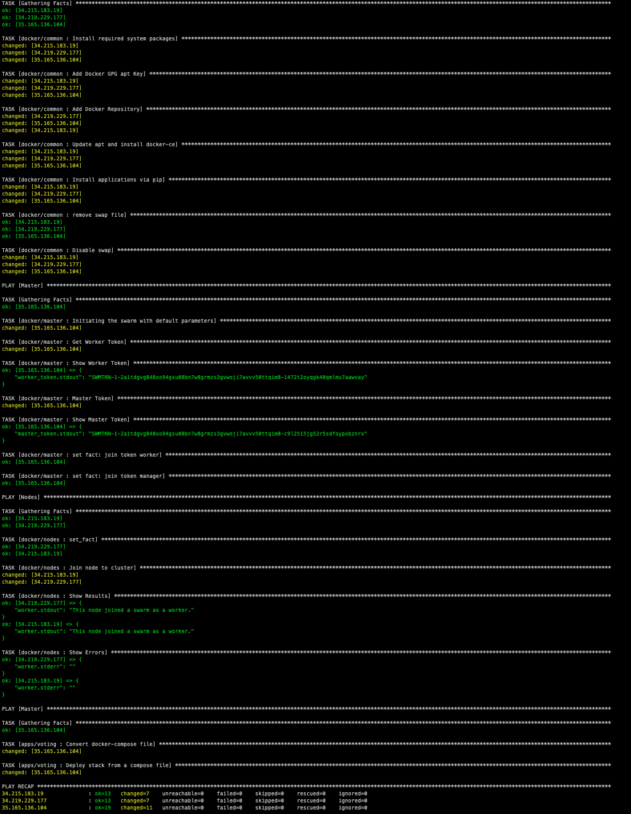
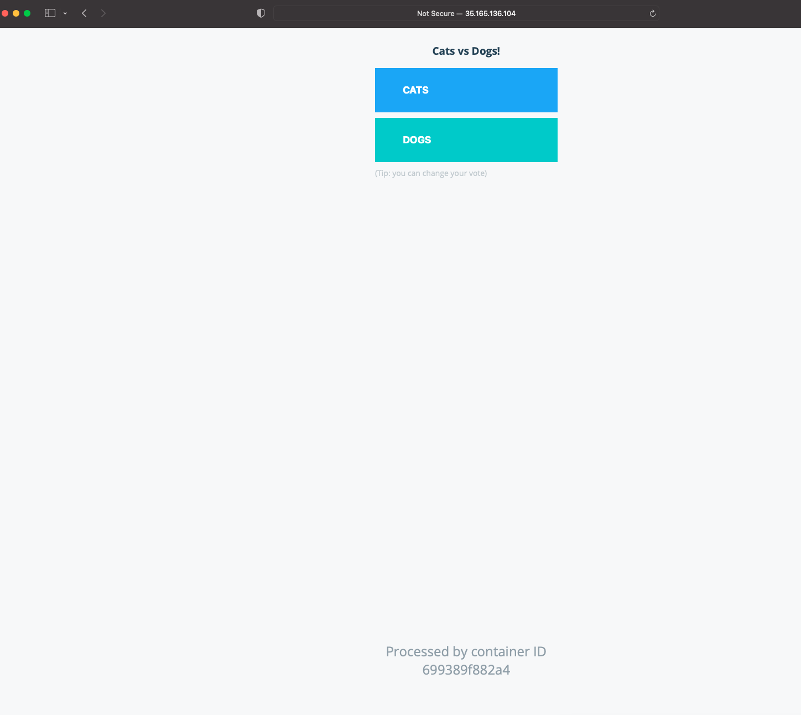

# Docker Swarm Simple pipeline - Create a docker swarm cluster

This pipeline is based on this [documentation](https://medium.com/@lessandro.ugulino/docker-swarm-part-5-d7ccccb98ff8). This will deploy six docker swarm services.

## Index

- [Architecture](#architecture)
- [Deployment Pipeline](#deployment-pipeline)
- [How to Deploy](#how-to-deploy)
  - [Update host file](#update-host-file)
  - [Update ansible config file](#update-ansible-config-file)
  - [Dependencies](#dependencies)
  - [Deploy](#deploy)
- [Result](#result)

## Architecture

For this pipeline I'm considering you already have deployed the EC2 instances. I've deployed 3 `t2.medium` Ubuntu EC2, but you can use 2 `t2.small` Ubuntu EC2 for testing purposes.

_Proposed environment deployed prior to this activity_



_Docker application that will be deployed via this automation_



## Deployment Pipeline



# How to Deploy

## Update host file

Update the `hosts.yml` (inventory/hosts.yml) file with the EC2 public and private IP addresses.

```yml
# Update EC2 public and private IP address.
all:
  vars:
    ansible_ssh_user: ubuntu
    masterEC2PublicIp: 13.211.66.130
    masterEC2PrivateIp: 192.168.49.25
  children:
    Master:
      hosts:
        13.211.66.130:
    Nodes:
      hosts:
        13.239.96.246:
        13.239.96.246:
```

## Update ansible config file

For this automation, we're using a `.pem` key to connect to the EC2s, but you can set up it as you wish.

Update _private_key_file_ to your `.pem` key path.

```hcl
[defaults]
inventory=./inventory/hosts.yml
host_key_checking=false
private_key_file= your_key.pem
```

## Dependencies

These tools need to be installed on your local machine or the computer that will run Ansible:

- <a href="https://docs.aws.amazon.com/cli/latest/userguide/cli-chap-install.html">AWS Cli</a>
- <a href="https://docs.ansible.com/ansible/latest/installation_guide/intro_installation.html#installing-ansible-on-macos">Ansible</a>

## Deploy

The below command will run the Ansible playbook and deploy the defined tasks on the targeted AWS EC2.

```
ansible-playbook deploy_docker_swarm.yml
```

## Result

The below output is expected, and once it's done you can access your Master public IP address on ports `5000` and `5001`




